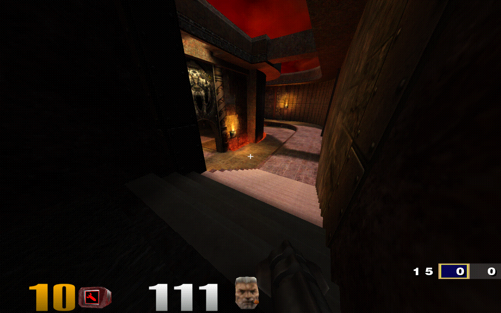
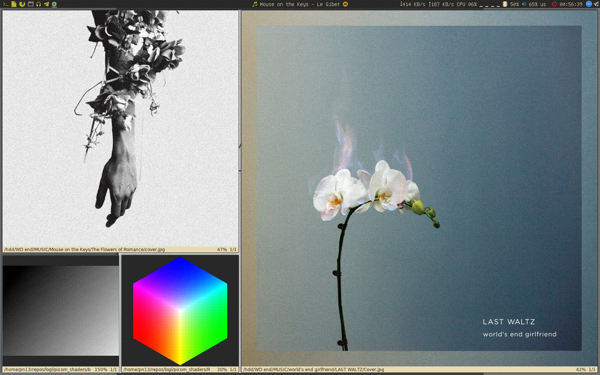
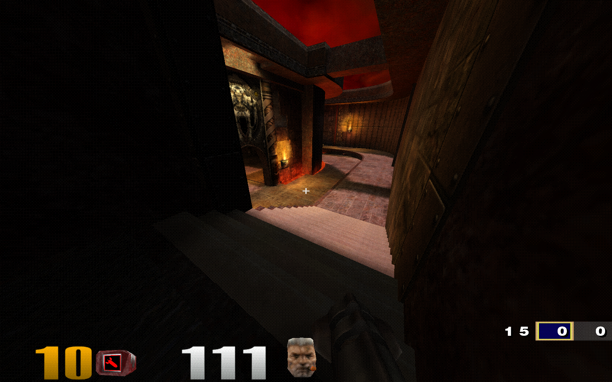

# picom-o8dither
Ordered dithering shader for picom.

## Why?
I just love that oldschool orderred dithering and I heard that it was pretty fast
as a fragment shader, so I decided to leard OpenGL because of it, lol.
And then I found out that picom has support for user-defined shaders and some people have
made pretty incredible stuff with them, so I just had to do it!

## Usage
`picom --window-shader-fg fadeDither.glsl`

## Demo
Screenshots were taken using 6-level quantization.
You may want to set a higher color count to make it less noticable, or the opposite.

### o8dither.glsl

### fakeDither.glsl

This video demonstrates two shaders with fading:

### halfFakeDither+Fade.glsl fadeDither4x2.glsl

